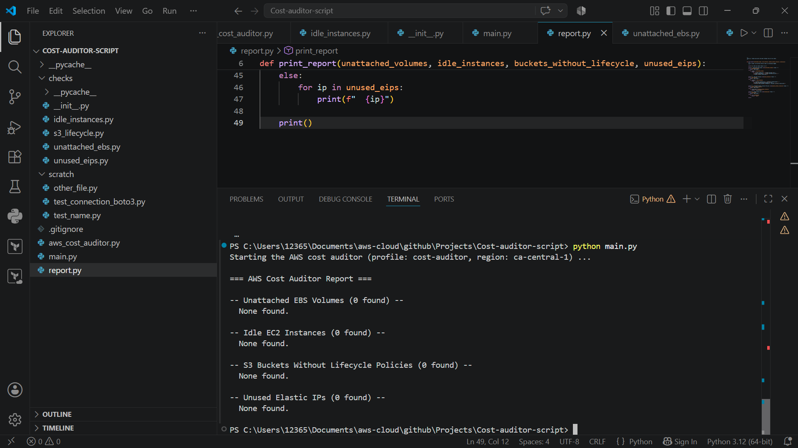
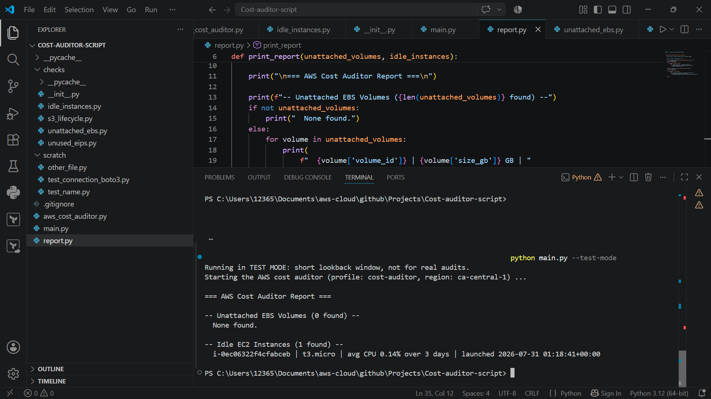

# AWS Cost & Resource Auditor

A read-only CLI tool that scans an AWS account for common sources of wasted spend: unattached EBS volumes, idle EC2 instances, S3 buckets without lifecycle policies, and unused Elastic IPs.

Built with Python and `boto3` to demonstrate practical AWS API integration - not just AWS certifications, but the ability to actually query, reason about, and report on live account state.

## Why this exists

Unused cloud resources are one of the most common sources of avoidable AWS spend, and finding them by hand across the console is slow and error-prone. This tool automates that scan: point it at a profile and region, and it reports exactly what's costing money for no reason.

## What it checks

| Check | What it flags | Why it matters |
|---|---|---|
| **Unattached EBS Volumes** | Volumes in `available` status (not attached to any instance) | You're billed for EBS storage whether or not it's attached to anything |
| **Idle EC2 Instances** | Running instances with average CPU below 5% over a lookback window | Compute you're paying for but not using |
| **S3 Buckets Without Lifecycle Policies** | Buckets with no lifecycle configuration set | Without a policy, old/incomplete objects accumulate indefinitely instead of transitioning to cheaper storage or expiring |
| **Unused Elastic IPs** | Allocated EIPs not associated with a running instance or network interface | AWS charges for EIPs that aren't attached to a running resource |

## Design principles

- **Read-only by default.** This tool only reads and reports — it never deletes or modifies resources. (A `--fix` flag for opt-in remediation is a planned stretch goal, see below.)
- **Fully paginated.** Every check that queries a paginated API (`describe_volumes`, `describe_instances`) uses boto3 paginators, so results are complete even on accounts with hundreds of resources — a naive single-call implementation would silently miss resources past the first page.
- **Fails safe.** Errors on individual resources (e.g. a permissions issue on one S3 bucket) are caught and logged as warnings rather than crashing the whole scan.

## Requirements

- Python 3.9+
- `boto3`
- An AWS credentials profile (via `aws configure --profile <name>`, or any credential source in boto3's standard resolution chain) with read permissions for:
  - `ec2:DescribeVolumes`, `ec2:DescribeInstances`, `ec2:DescribeAddresses`
  - `cloudwatch:GetMetricStatistics`
  - `s3:ListBuckets`, `s3:GetBucketLifecycleConfiguration`

## Installation

```bash
git clone https://github.com/fatemehfeizipour/aws-cost-auditor.git
cd aws-cost-auditor
pip install boto3
```

## Configuration

This tool doesn't ship with or require any specific AWS credentials - you use your own. If you don't already have an AWS CLI profile set up, create one:

```bash
aws configure --profile <your-profile-name>
```

You'll be prompted for your AWS access key, secret key, and default region. These are stored locally in your own `~/.aws/credentials` file and are never read from or written to this repository.

The tool defaults to a profile named `cost-auditor` and region `ca-central-1` — either name your profile `cost-auditor` to use the defaults, or pass your own profile name via `--profile` (see Usage below).

You don't need to edit any code to set your region either — pass it via `--region` on each run. The `ca-central-1` default only applies if you omit the flag.

## Usage

```bash
python main.py --profile cost-auditor --region ca-central-1
```

Optional flags:
- `--profile` — AWS CLI profile to use (default: `cost-auditor`)
- `--region` — AWS region to scan (default: `ca-central-1`)
- `--test-mode` — run without making live AWS calls (if applicable — adjust wording if it behaves differently)

**Options:**

| Flag | Description | Default |
|---|---|---|
| `--profile` | Named AWS CLI profile to use | `cost-auditor` |
| `--region` | AWS region to scan | `ca-central-1` |
| `--test-mode` | Shrinks the idle-instance lookback window to ~1.2 hours (5-minute CloudWatch datapoints) instead of the standard 14 days. Useful for verifying idle-instance detection against a freshly-launched test instance without waiting two weeks. **Not for real audits.** | off |

## Sample output

**Clean account (no waste found):**

```
=== AWS Cost Auditor Report ===

-- Unattached EBS Volumes (0 found) --
  None found.

-- Idle EC2 Instances (0 found) --
  None found.

-- S3 Buckets Without Lifecycle Policies (0 found) --
  None found.

-- Unused Elastic IPs (0 found) --
  None found.
```

**Idle instance detected (test run against a deliberately idle t3.micro):**

```
Running in TEST MODE: short lookback window, not for real audits.
=== AWS Cost Auditor Report ===

-- Unattached EBS Volumes (0 found) --
  None found.

-- Idle EC2 Instances (1 found) --
  i-0ec06322f4cfabceb | t3.micro | avg CPU 0.14% over 3 datapoints | launched 2026-07-31 01:18:41+00:00
```

**Clean run:**



**Idle instance caught during test-mode run:**



## Project structure

```
cost-auditor-script/
├── main.py                  # CLI entry point (argparse, session/client setup)
├── report.py                 # Formats and prints findings
├── checks/
│   ├── __init__.py
│   ├── unattached_ebs.py     # Unattached EBS volume check
│   ├── idle_instances.py     # Idle EC2 check (EC2 + CloudWatch)
│   ├── s3_lifecycle.py       # S3 lifecycle policy check
│   └── unused_eips.py        # Unused Elastic IP check
└── README.md
```

## How idle-instance detection works

The idle-instance check is the most involved of the four, since it chains two AWS services:

1. Paginate through `describe_instances`, filtered to `running` instances only.
2. For each instance, query CloudWatch's `AWS/EC2` namespace for `CPUUtilization`, averaged over daily periods across a 14-day lookback window.
3. Flag any instance whose average CPU falls below 5%.

**Known limitation:** this check only looks at CPU. An instance can be CPU-idle while still doing meaningful work on network or memory (e.g. a lightly-loaded NAT instance or cache server) — a genuinely idle detector would ideally also look at network I/O. Flagged instances should be reviewed before termination, not auto-deleted based on this signal alone.

## Roadmap / stretch goals

- [ ] `--dry-run` / `--fix` flag pattern — opt-in remediation (e.g. releasing unused EIPs, deleting unattached volumes) behind an explicit flag, keeping read-only as the safe default
- [ ] Resource tagging for findings, so flagged resources can be tracked over time
- [ ] Cost estimation per finding (e.g. estimated monthly cost of each unattached volume) using AWS Pricing API

## Tech stack

Python · boto3 · AWS (EC2, EBS, S3, CloudWatch, Elastic IP) · argparse

Walkthrough video: 
https://www.linkedin.com/posts/fatemeh-feyzipour_aws-python-boto3-activity-7489349478773260288-vzou?utm_source=share&utm_medium=member_desktop&rcm=ACoAADOdEekBNejZcME7HcR483AQlDee7t4jnBU
